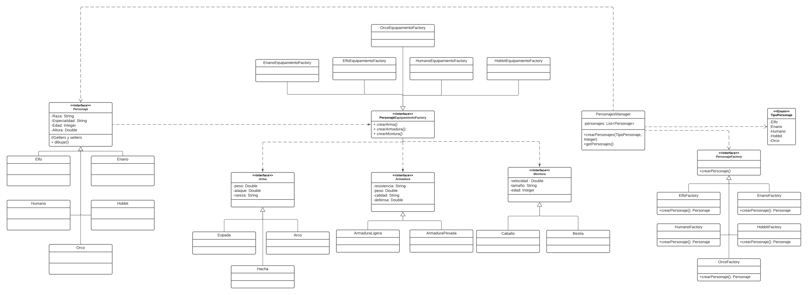

<h1>Patrones creacionales</h1>

<h4>INTEGRANTES: </h4>

  <ul>

   <li>Daniel Felipe Burgos Moceton (20182020077)</li>
   <li>Jersson Javier Ortegate Banderas (20201020139)</li>
   <li>Santiago Jose Garcia Toro (20201020170)</li>

  </ul>

    <h3>Descripción:</h3>
    
El programa genera un numero de guerreros basandose en las peliculas del señor de los anillos, el usuario proporciona la cantidad de estos y por medio del Abstract
    Factory se genera el equipamento del personaje y el Factory Method para entregar el personaje con todas sus caracteristicas.

        <h3>Diagrama UML de clases: </h3>
        

